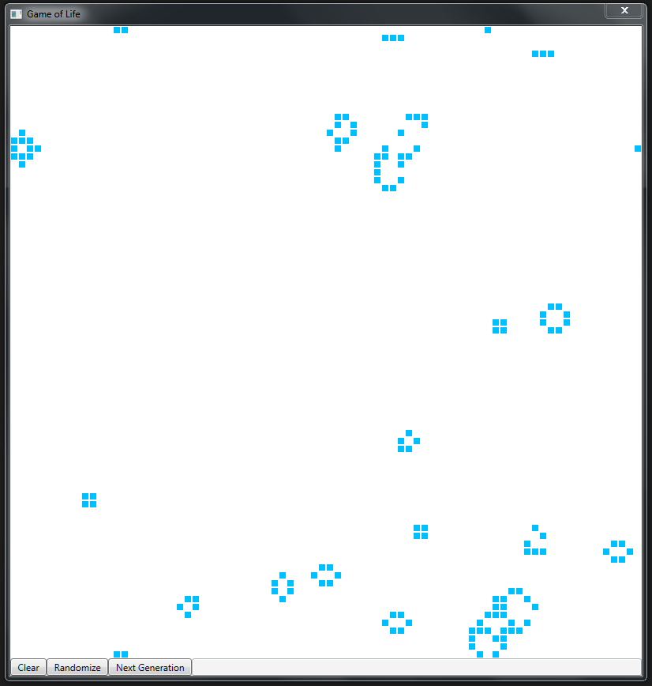

# GameOfLife

Conway's Game of Life in a lightweight .NET 4.5 app

## Prerequisites

* [Visual Studio 2015/2017](https://www.visualstudio.com/de/vs/) - An IDE for developing .NET apps

## Deployment

Just copy over `GameOfLife.exe` and run it. An installation is not needed.

## Built With

* [Costura](https://github.com/Fody/Costura) - Embeds dependencies as resources

## Authors

* **Robin Hartmann** - *Initial work* - [RobinHartmann](https://github.com/RobinHartmann)

## License

This project is licensed under the MIT License - see the [LICENSE](LICENSE) file for details